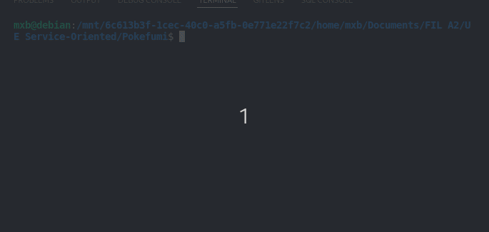
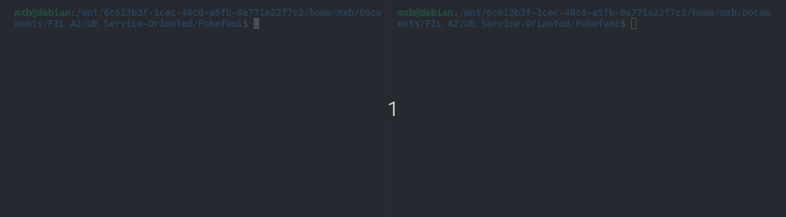
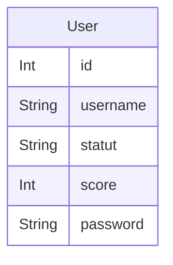
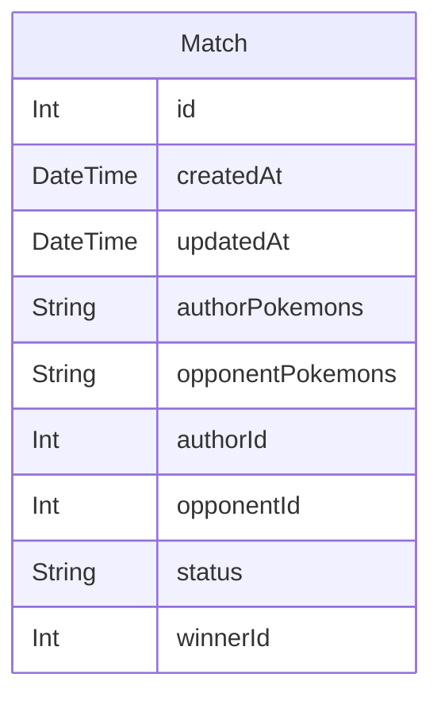
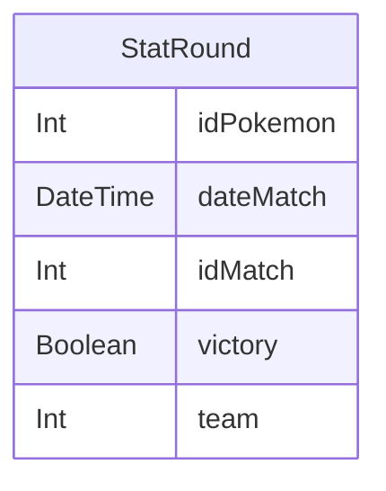

# 1. Pokefumi : Nx + Docker + Typescript + Express + Jwt + OpenAPI + Jest

Poke-fu-mi est une application qui permet d'organiser des combats entre maîtres Pokémon mais les règles ne sont pas exactement celles du jeu classique.

Pour le déroulement d'une partie, voilà ce qu'il se passe (en considérant que les joueurs ont déjà créé un compte et ont composé une liste de pokemon pour jouer) :

1. Un joueur crée un Salon.
2. Un second joueur peut rejoindre le salon soit par une invitation, soit en accédant à un salon public sans invitation.
3. Le match est lancé, les 10 pokemon de chaque joueur vont être confrontés dans une succession de rounds 2 à 2.
4. Chaque round consiste à comparer les types de chaque pokemon et à déclarer le vainqueur du round selon le nombre de points gagnés pour chaque type supérieur à l'adversaire.
5. Lorsque les 10 rounds ont été réalisés, le joueur vainqueur du match est celui qui aura accumulé le plus de points.
6. Le salon est clos. Pour lancer une nouvelle partie, le joueur revient à l'étape 1.

- [1. Pokefumi : Nx + Docker + Typescript + Express + Jwt + OpenAPI + Jest](#1-pokefumi--nx--docker--typescript--express--jwt--openapi--jest)
  - [1.1. Fonctionnalités](#11-fonctionnalités)
  - [1.2. Démos](#12-démos)
  - [1.3. Résumé du travail réalisé par rapport aux spécifications fournies](#13-résumé-du-travail-réalisé-par-rapport-aux-spécifications-fournies)
    - [1.3.1. Fonctionnalités](#131-fonctionnalités)
    - [1.3.2. Contraintes](#132-contraintes)
  - [1.4. Schéma d'architecture](#14-schéma-darchitecture)
  - [1.5. Description des différents services](#15-description-des-différents-services)
    - [1.5.1. Tableau résumé](#151-tableau-résumé)
    - [1.5.2. Graphe de dépendance Nx](#152-graphe-de-dépendance-nx)
    - [1.5.3. Résumé de chaque entité](#153-résumé-de-chaque-entité)
  - [1.6. Choix techniques](#16-choix-techniques)
    - [1.6.1. Généraux](#161-généraux)
      - [1.6.1.1. Approche "schema-first" ?](#1611-approche-schema-first-)
      - [1.6.1.2. Pourquoi utiliser Nx ?](#1612-pourquoi-utiliser-nx-)
      - [1.6.1.3. Prisma ?](#1613-prisma-)
      - [1.6.1.4. NPM Workspaces : pourquoi nous avons du les abandonner](#1614-npm-workspaces--pourquoi-nous-avons-du-les-abandonner)
      - [1.6.1.5. Déploiement continu avec Heroku ?](#1615-déploiement-continu-avec-heroku-)
      - [1.6.1.6. Test end to end - Jest](#1616-test-end-to-end---jest)
    - [1.6.2. API Gateway](#162-api-gateway)
    - [1.6.3. User service](#163-user-service)
    - [1.6.4. Matchmaking service](#164-matchmaking-service)
    - [1.6.5. Round service](#165-round-service)
    - [1.6.6. Stats service](#166-stats-service)
  - [1.7. Documentation de référence et exemples de requêtes / réponses](#17-documentation-de-référence-et-exemples-de-requêtes--réponses)
  - [1.8. Pour tester les microservices](#18-pour-tester-les-microservices)
    - [1.8.1. Sans Docker et sans l'API Gateway ("boite blanche")](#181-sans-docker-et-sans-lapi-gateway-boite-blanche)
      - [1.8.1.1. Premier lancement](#1811-premier-lancement)
      - [1.8.1.2. Exécuter les tests d'intégration sans API Gateway avec Jest](#1812-exécuter-les-tests-dintégration-sans-api-gateway-avec-jest)
    - [1.8.2. Avec Docker, docker-compose et l'API Gateway Krakend ("boite noire")](#182-avec-docker-docker-compose-et-lapi-gateway-krakend-boite-noire)
      - [1.8.2.1. Lancement des micro-services](#1821-lancement-des-micro-services)
      - [1.8.2.2. Tests d'intégration au travers de l'API Gateway avec un script bash](#1822-tests-dintégration-au-travers-de-lapi-gateway-avec-un-script-bash)
  - [1.9. Liste des targets nx](#19-liste-des-targets-nx)
  - [1.10. Choix de conception](#110-choix-de-conception)
    - [1.10.1. Schémas de base de données](#1101-schémas-de-base-de-données)
      - [1.10.1.1. User service](#11011-user-service)
      - [1.10.1.2. Matchmaking service](#11012-matchmaking-service)
      - [1.10.1.3. Stats service](#11013-stats-service)
    - [1.10.2. API Stats](#1102-api-stats)
    - [1.10.3. Distinction entre Matchmaking et Round](#1103-distinction-entre-matchmaking-et-round)
    - [1.10.4. V1 (version implémentée)](#1104-v1-version-implémentée)
    - [1.10.5. V2 (non implémenté)](#1105-v2-non-implémenté)
  - [1.11. Evolutions possibles de l'application](#111-evolutions-possibles-de-lapplication)
    - [1.11.1. Système de salon](#1111-système-de-salon)
    - [1.11.2. Statistiques sur l'activité](#1112-statistiques-sur-lactivité)
    - [1.11.3. Meilleure gestion des erreurs](#1113-meilleure-gestion-des-erreurs)
    - [1.11.4. Bonus 💰 : comment ajouter un service de vente de Pokemon "rares" que l'on peut ajouter à son Docker ?](#1114-bonus---comment-ajouter-un-service-de-vente-de-pokemon-rares-que-lon-peut-ajouter-à-son-docker-)

## 1.1. Fonctionnalités

- Node.JS 16 + Typescript 4.6
- [Nx monorepo](https://nx.dev/) :
  - targets pour construire le projet, générer la documentation, construire les images docker, faire des tests, etc.
  - Webpack 5 pour un développement plus rapide
- Prettier + Eslint
- Approche "schema-first" :
  - Clients axios rest générés à partir des schémas OpenAPI avec [openapi-typescript-codegen](https://github.com/ferdikoomen/openapi-typescript-codegen)
  - Routeur et stubs générés à partir du schéma OpenAPI avec [oats-ts](https://github.com/oats-ts/oats-ts)
  - Base de données SQLite générée à partir d'un schéma avec l'ORM [Prisma](https://www.prisma.io/)
- Documentation des endpoints Rest générée à partir des schémas OpenAPI avec [widdershins](https://github.com/Mermade/widdershins/)
- [.devcontainer](https://code.visualstudio.com/docs/remote/containers) disponible pour lancer facilement un environnement de développement avec vscode
- Tests d'intégrations avec Jest
- Microservices rest écrits avec le routeur Express.JS
- Authentification des utilisateurs par jeton JWT avec [express-jwt](https://github.com/auth0/express-jwt)
- Validation avec [zod](https://github.com/colinhacks/zod) des corps de requête
- Api Gateway avec [Krakend-ce](https://github.com/devopsfaith/krakend-ce)
  - Configuration générée à partir des schémas OpenAPI avec [openapi2krakend](https://github.com/okhuz/openapi2krakend)
- Déploiement continu avec Heroku

## 1.2. Démos

Tests [e2e](packages/pokefumi-e2e/src/lib/pokefumi-e2e.spec.ts) : execution automatique des tests d'intégration pour tester chaque endpoint de chaque microservice.

> Automatise un scénario de test de match avec deux utilisateurs de bout en bout (du service `user` au service `stats`).
Efface les bases de données et créé les utilisateurs au démarrage.



Docker-compose avec l'Api Gateway Krakend et le script [test.sh](./test.sh).

> Lance les containers puis un scénario de test de match avec deux utilisateurs à l'aide d'un script de Bash et de Curl.
Créé les utilisateurs, obtient leur jeton JWT, créé le match et créé un Deck.
Affiche ensuite le score des joueurs et les stats.



## 1.3. Résumé du travail réalisé par rapport aux spécifications fournies

### 1.3.1. Fonctionnalités

1. [x] En tant que joueur, je peux …

   1. [x] m'inscrire à la plateforme avec un nom d'utilisateur unique
   2. [x] me connecter à la plateforme en utilisant mon nom d’utilisateur et un mot de passe
   3. [x] voir la liste des joueurs (avec leur score cummulé sur toutes leurs parties)
   4. [x] voir la liste des matchs (en cours, terminés, en attente)
   5. [x] voir les détails d’un match: joueurs, Pokemons utilisés, etc
   6. [x] inviter un autre joueur à un match (créer un match)
   7. [x] consulter les invitations reçues
   8. [x] accepter une invitation à un match (joindre un match existant)
   9. [x] créer un deck pour un match
   10. [x] envoyer un Pokemon à l’arena et consulter le résultat du combat (le joueur n'envoie pas un Pokemon en particulier mais envoie un deck, donc au moins un Pokemon, à l'arena)

2. [ ] En tant qu’administrateur, je peux …

   1. [x] me connecter à la plateforme en utilisant mon nom d’utilisateur et un mot de passe
   2. [x] voir la liste des joueurs
   3. [x] voir la liste des matchs
   4. [ ] effacer et modifier les joueurs et les matchs
   5. [x] consulter les statistiques de la plateforme : nombre de matchs par jour, nombre de matchs par Pokemon, nombre de victoires par Pokemon, etc

### 1.3.2. Contraintes

1. [x] Pour accéder aux ressources exposées par l’API gateway, il faut être authentifié (sauf pour l’inscription et le login) (partiellement réalisé, mais possible avec Krakend)
2. [x] Un joueur ne peut pas participer à plus de 3 matchs simultanément
3. [x] Pour avoir le résultat d’un combat, les deux joueurs ont du avoir envoyé leur Pokemon à l’arena
4. [x] Pour la version finale :
   1. [x] On ne peut pas accéder aux endpoints de microservices directement, seulement via un proxy/gateway
   2. [x] Trouver un moyen de produire des statistiques sans requêter directement l’API qui est trop surchargée

## 1.4. Schéma d'architecture


## 1.5. Description des différents services

### 1.5.1. Tableau résumé

L'application est divisée en 4 services principaux : user, match, matchmaking, stats

| Nom du service | API Gateway | User service                                                                                                                                                                                                                                                                    | Matchmaking service                                                                                                                                                                                                                                                                                                                                                                     | Stat service                                                                                                                    | Round service                                                   |
| -------------- | ----------- | ------------------------------------------------------------------------------------------------------------------------------------------------------------------------------------------------------------------------------------------------------------------------------- | --------------------------------------------------------------------------------------------------------------------------------------------------------------------------------------------------------------------------------------------------------------------------------------------------------------------------------------------------------------------------------------- | ------------------------------------------------------------------------------------------------------------------------------- | --------------------------------------------------------------- |
| Actions        | Interface   | <ul><li>m'inscrire à la plateforme avec un nom d'utilisateur unique</li> <li>me connecter à la plateforme en utilisant mon nom d’utilisateur et un mot de passe</li> <li>voir la liste des joueurs (avec leur score)</li> <li>effacer et modifier les joueurs (ADMIN)</li></ul> | <ul><li>voir la liste des matchs</li><li>voir les détails d’un match: joueurs, Pokemons utilisés, etc</li> <li>inviter un autre joueur à un match (creer un match)</li> <li>consulter les invitations reçues </li><li>accepter une invitation à un match (joindre un match existant)</li><li>effacer et modifier les matchs (ADMIN only) </li><li>créer un deck pour un match</li></ul> | <ul><li>nombre de matchs par jour</li> <li>nombre de matchs par Pokemon</li> <li>nombre de victoires par Pokemon, etc</li></ul> | envoyer un Pokemon à l’arena et consulter le résultat du combat |
| Dépendances    | *           |                                                                                                                                                                                                                                                                                 | User service (besoin du nom d’utilisateur) Pokeapi                                                                                                                                                                                                                                                                                                                                      |                                                                                                                                 | Matchmaking service, Stats service (envoi des stats) Pokeapi    |
| Tables (BDD)   | N/A         | User                                                                                                                                                                                                                                                                            | Match                                                                                                                                                                                                                                                                                                                                                                                   | StatRound                                                                                                                       | N/A (utilise un cache LRU en mémoire vive)                      |

### 1.5.2. Graphe de dépendance Nx

> Ce graphique a été généré avec la commande `nx graph`


### 1.5.3. Résumé de chaque entité

- Applications (microservices Rest ExpressJS)
  - [apps/user](apps/user/) : pour gérer les informations de chaque utilisateur et la création de nouveaux utilisateurs. Écoute sur le port `3333`
  - [apps/matchmaking](apps/matchmaking/) : pour gérer les invitations à un match vers un autre joueur ou afficher les matchs publics. Écoute sur le port `3334`
  - [apps/round](apps/round/) : pour gérer le déroulement d'un combat, en confrontant deux à deux chaque Pokemon et en donnant le score. Écoute sur le port `3335`
  - [apps/stats](apps/stats/) : pour obtenir les statistiques sur les matchs en général (scores, victoires). Écoute sur le port `3337`
- Packages (bibliothèques de code)
  - [packages/pokefumi-api](packages/pokefumi-api/) : client axios Rest générés à partir de [openapi-typescript-codegen](https://github.com/ferdikoomen/openapi-typescript-codegen)
  - [packages/pokefumi-e2e](packages/pokefumi-e2e/) : tests jest d'intégration
  - [packages/pokefumi-common](packages/pokefumi-common/) : ancienne couche modèle, en partie utilisée par le service `Round`

## 1.6. Choix techniques

Plusieurs choix techniques ont été décidés au cours du développement de l'application pour s'adapter aux imprévus ou améliorer le projet.

### 1.6.1. Généraux

#### 1.6.1.1. Approche "schema-first" ?

Une approche qui consiste à d'abord penser au schéma d'API avant de coder ! Cela permet de modéliser notre API Rest et de bien y réfléchir (comme en GraphQL).
De plus, le fait d'avoir un schéma OpenAPI permet de générer la documentation et les clients axios facilement !
Le package [@pokefumi/pokefumi-api](./packages//pokefumi-api/) est généré automatiquement à partir des schémas OpenAPI.

#### 1.6.1.2. Pourquoi utiliser Nx ?

[Nx](https://nx.dev/), c'est l'outil de construction fait pour les monorepos.
Il est pratique, et pas pratique à la fois.

- Avantages :
  - génération de code avec des `generators` : les squelettes de code de chaque service ont été générés au départ
  - exécuter la construction de tous les services en une seule commande
  - système de cache : on ne reconstruit les projets que si le code à changé
  - Hot Module Reload de webpack : c'est mieux que nodemon car on ne recharge que le code modifié
- Désavantages :
  - Nx utilise webpack 5 et nous n'avons pas de moyen de le désactiver. On peut avoir des problèmes en Node.JS, par exemple pour détecter les bibliothèques qui sont natives de celles qui sont téléchargées (voir le fichier [webpack.config.js](./webpack/webpack.config.js) pour voir un workaround)
  - il fonctionne très mal avec prisma ! En effet, prisma génère [un client](https://www.prisma.io/docs/concepts/components/prisma-client)  `@prisma/client` qui sert à contacter la base de données. Le problème est que lorsque plusieurs services utilisent prisma, il existe plusieurs `@prisma/client` générés, un pour chaque service.
  - Webpack à du mal à différencier les services. Une solution, c'est de faire [ceci](https://github.com/IMT-Atlantique-FIL-2020-2023/Pokefumi/blob/c7d9d2664b1260cdaa3546d270d5692c66c4a62e/apps/matchmaking/prisma/schema.prisma#L6)

#### 1.6.1.3. Prisma ?

[Prisma](https://www.prisma.io/) est un ORM Typescript en plein essor qui permet de gérer la base de données. Il est "type-safe".
Il est très facile à utiliser, mais possède quelques inconvénients :

- Il utilise un moteur de requête SQL écrit en Rust, ce qui implique un téléchargement supplémentaire
- Il est encore instable (incompatibilité avec les NPM workspace par ex.).

#### 1.6.1.4. NPM Workspaces : pourquoi nous avons du les abandonner

Les [NPM workspaces](https://docs.npmjs.com/cli/v7/using-npm/workspaces/) sont une fonctionnalité intéressante, comparable au yarn workspaces mais en moins bien.
Elles ont été développées et publiées en 2020 et restent instables. Elle permettent dans une structure monorepo d'installer les dépendances du parent et des enfants en une seule commande. De plus, les dépendances communes entre les enfants sont partagées : un arbre de dépendance est construit et des liens symboliques sont créés. Cela permet d'économiser de l'espace de stockage. Hélas, il y a des incompatibilités avec Prisma. De plus, si deux sous-projets utilisent une même bibliothèque mais avec une version différente, la version la plus haute sera prise.

#### 1.6.1.5. Déploiement continu avec Heroku ?

C'est plus sympathique quand on peut voir le résultat en direct de notre commit !
Heroku permet de déployer chaque micro-service à chaque modification de code. Ils tournent dans une image docker.

Liste des services déployés avec endpoint "exemple" :

- <https://pokefumi-user.herokuapp.com/users>
- <https://pokefumi-matchmaking.herokuapp.com/matchs>
- <https://pokefumi-round.herokuapp.com/api>
- <https://pokefumi-stats.herokuapp.com/rounds/count-a-day-last-30-days>

#### 1.6.1.6. Test end to end - Jest

Les tests e2e sont réalisés avec [Jest](https://jestjs.io/).
C'est un framework de tests très populaire.
Les tests sont fais de bouts en bouts, en déroulant un scénario de création d'utilisateur, de match et de participations à des rounds.
Tous les services sont ainsi testés.

Voir [okefumi-e2e.spec.ts](packages/pokefumi-e2e/src/lib/pokefumi-e2e.spec.ts).

### 1.6.2. API Gateway

Nous avons choisi d'utiliser un API Gateway différent que celui vu en cours (Nginx) : [Krakend-ce](https://github.com/devopsfaith/krakend-ce).
Car il :

- est portable (un seul fichier binaire, cross-plateforme)
- est écrit en Golang
- est facilement extensible avec des plugins téléchargés à la volée
- supporte les Jetons d'authentification JWT gratuitement (ce n'est pas le cas de Nginx, seulement dans la version entreprise)
- possède un très bon module de debug dans la sortie standard
- s'interface bien avec la norme OpenAPI, il existe un outil nommé [openapi2krakend](https://github.com/okhuz/openapi2krakend) qui permet de générer la configuration Krakend à partir d'un ensemble de schéma OpenAPI

### 1.6.3. User service

Le service de `User` utilise l'ORM `Prisma` pour gérer la base de données SQLite, notamment la table `Match`.
Voir le fichier [prisma.schema.prisma](apps/user/prisma/schema.prisma).

Il hash les mots de passe avec le module `crypto` de Node.JS en SHA-256.
Cela permet d'éviter une éventuelle fuite des mots de passes.
Voir [user.repository.ts](https://github.com/IMT-Atlantique-FIL-2020-2023/Pokefumi/blob/460d3b76b76017210c78a3c18a4ec53d1b736535/apps/user/src/app/repository/user.repository.ts#L44-L45).

Lorsque l'utilisateur se connecte, il obtient un jeton JWT.
Ce jeton est chiffré à l'aide de l'algorithme HS-256. Il contient un payload avec l'ID de
l'utilisateur connecté et la date d'expiration du jeton.
Cela permet une authentification sans états et donc éviter un stockage de session côté serveur.
Voir [user.repository.ts](https://github.com/IMT-Atlantique-FIL-2020-2023/Pokefumi/blob/460d3b76b76017210c78a3c18a4ec53d1b736535/apps/user/src/app/repository/user.repository.ts#L50-L51)

Le champs `statut` du [schéma de BDD](#1101-sch%C3%A9mas-de-base-de-donn%C3%A9es) a été mis en prévision d'un système de statut (inactif, en jeu, etc.).

### 1.6.4. Matchmaking service

Le service de `Matchmaking` utilise lui aussi l'ORM `Prisma` pour gérer la base de données SQLite, notamment la table `Match`.
Voir le fichier [prisma.schema.prisma](apps/matchmaking/prisma/schema.prisma).

Il authentifie les utilisateurs (pour la création du match et pour en joindre un) avec un jeton JWT (`express-jwt`).
Cela permet une authentification sans états et donc éviter un stockage de session côté serveur.

Comparé aux autres services, il possède une spécificité : les corps de requêtes et les paramètres d'URL sont validés avec [zod](https://github.com/colinhacks/zod) et le middleware `zod-express-middleware`.
Zod est une bibliothèque de validation moderne qui permet de créer des schémas de validation (voir [matchmaking.controller.ts](apps/matchmaking/src/app/controllers/matchmaking.controller.ts)) pour exemple.
Zod est très modulable et possède une fonctionnalité d'inférence de type très intéressante, qui permet d'extraire les [types natifs à partir d'un schéma](https://github.com/IMT-Atlantique-FIL-2020-2023/Pokefumi/blob/cb0b1329e5f4e953d1925d7780f515a39c7ae43e/apps/matchmaking/src/app/controllers/matchmaking.controller.ts#L13).

La gestion des erreurs se fait avec le middleware `express-async-handler`, qui permet de simplifier la tâche.

Nous avons décidé de stocker les 10 Pokemons dans un champs de type texte.
Le format est le suivant : `ID ID ID...`. 10 ID séparés par des espaces.
Cela permet d'éviter d'avoir une table servant juste à stocker des Pokemons.
Par contre, cela nécessite de la validation côté client pour être sûr du stockage des 10 Pokemons sous ce format-ci.
C'est là ou `zod` rempli sa mission.
Voir [matchmaking.controller.ts#L19-L23](https://github.com/IMT-Atlantique-FIL-2020-2023/Pokefumi/blob/460d3b76b76017210c78a3c18a4ec53d1b736535/apps/matchmaking/src/app/controllers/matchmaking.controller.ts#L19-L23).

### 1.6.5. Round service

Le service `Round` authentifie les utilisateurs (pour la création du match et pour en joindre un) avec un jeton JWT (`express-jwt`).
Cela permet une authentification sans états et donc éviter un stockage de session côté serveur.

Pour stocker les rounds, il utilise un cache 'last recently used' qui classe les rounds par ordre d'utilisation.
Tout est stocké dans la mémoire vive pour un temps donnée, ainsi il n'y a pas de persistence sur les rounds.
Voir [cet exemple](https://github.com/IMT-Atlantique-FIL-2020-2023/Pokefumi/blob/d3c817786c134baa07fc6d543e35114bcaf98018/apps/round/src/app/resolveMatch.ts#L61-L62)

**Comment faire pour attendre que l'autre joueur joue son Pokemon ?**

Notre choix a été de garder la connexion ouverte tant que l'autre joueur n'a pas joué son Pokemon.
Ainsi, lorsque le premier joueur envoi un pokemon à l'arena,
il est attente de réponse. Lorsque le second adversaire joue, les deux sont débloqués et reçoivent le résultat du round.
Le délai d'attente (*timeout*) maximum de réponse est de 30 secondes.
Si au bout de 30 secondes, l'autre joueur n'a pas joué, la connexion est coupée.

Une meilleure implémentation serait avec des Websocket, qui permettre d'éviter les temps d'attentes bloquants.

### 1.6.6. Stats service

Le service de `Stats` utilise lui aussi l'ORM `Prisma` pour gérer la base de données SQLite, notamment la table `StatRound`.
Voir le fichier [prisma.schema.prisma](apps/stats/prisma/schema.prisma).

Le routeur express.js, les types et les schémas de validation sont entièrement générés avec [oats-ts](https://github.com/oats-ts/oats-ts) à partir du schéma OpenAPI [stats.schema.yaml](apps/stats/stats.schema.yaml).
Les fichiers générés sont stockés dans le dossier [apps/stats/src/app/generated-oats/](apps/stats/src/app/generated-oats/).
Voir par exemple le [routeur](apps/stats/src/app/generated-oats/routers/) ou encore les [types de réponses](apps/stats/src/app/generated-oats/responses/).
Le script de génération est le fichier [generate.ts](apps/stats/scripts/generate.ts).

Cela nous permet de faire en sorte que le service `Stats` corresponde bien à son modèle spécifié dans le schéma OpenAPI. De plus, toute la partie validation des corps de requêtes et des paramètres de chaîne est générée.
Le développeur n'a qu'a implémenter le code métier, coeur du service en "codant dans les trous", c-a-d en implémentant les stubs.
Voir le fichier d'implémentation [StatsApiImpl.ts](apps/stats/src/app/StatsApiImpl.ts)

Oats-ts est encore un outil jeune, mais il est prometteur !

**Comment obtenir les statistiques de manière intelligente ?**

Il était demandé de *"trouver un moyen de produire des statistiques sans requêter directement l’API qui est trop surchargée"*.
Nous en avons trouvé un : les statistiques sont envoyées par le service `Round` à chaque round.
Elles sont agrégés par le service `Stats` à la demande du client. Cela permet d'éviter d'appeler les services `Round` et `Matchmaking`.
Ainsi, les statistiques se font seulement sur les rounds.

## 1.7. Documentation de référence et exemples de requêtes / réponses

> Note: chaque service possède un fichier OpenAPI décrivant ses endpoints (voir [matchmaking.schema.yaml](./apps/matchmaking/matchmaking.schema.yaml) par exemple). La documentation ci-dessous est générée à l'aide de [widdershins](https://github.com/Mermade/widdershins)

- Service de gestion des utilisateurs, *pour gérer les informations de chaque utilisateur et la création de nouveaux utilisateurs* : [docs/user.md](docs/user.md)
- Service de matchmaking, *pour gérer les invitations à un match vers un autre joueur ou afficher les matchs publics* : [docs/matchmaking.md](docs/matchmaking.md)
- Service de gestion d'un round, *pour gérer le déroulement d'un combat, en confrontant deux à deux chaque Pokemon et en donnant le score*: [docs/round.md](docs/round.md)
- Service de statistiques, *pour obtenir les statistiques sur les matchs en général (scores, victoires)* : [docs/stats.md](docs/stats.md)

## 1.8. Pour tester les microservices

### 1.8.1. Sans Docker et sans l'API Gateway ("boite blanche")

Pour lancer : utiliser le [devcontainer vscode](https://code.visualstudio.com/docs/remote/containers), ou installer nx en global (faire la commande dans un terminal) : `npm i -g nx`.

Version de nodejs conseillée : `16.X.X`

#### 1.8.1.1. Premier lancement

1. Installer les dépendances `npm i && nx affected --target=install --all`
2. Générer tous les clients prisma `nx affected --target=generate --all`
3. Créer les BDD sqlite `nx affected --target=push --all`
4. Créer un fichier .env à la racine de chaque micro-service dans `apps/` avec le secret du jeton JWT. Par exemple :

    ```dotenv
    # apps/user/.env
    
    # Clef de chiffrement utilisée pour chiffrer les jetons
    JWT_SECRET=ILIKEPOTATOES

    ```

5. Ensuite pour lancer le user service : `nx run user:serve`. Pour lancer le matchmaking service par ex. :  `nx run matchmaking:serve`.

#### 1.8.1.2. Exécuter les tests d'intégration sans API Gateway avec Jest

Des tests automatisés sont disponibles pour tester les services. Ils sont programmés avec Jest. Ils lancent automatiquement les micro-services. Voir [packages/pokefumi-e2e/src/lib/pokefumi-e2e.spec.ts](packages/pokefumi-e2e/src/lib/pokefumi-e2e.spec.ts).

> Note : les bases de données sont effacées au démarrage des tests.  
> Éteignez tous les microservices avant de lancer les tests, ils seront démarrés automatiquement.

```bash
nx run pokefumi-e2e:test-e2e
```

### 1.8.2. Avec Docker, docker-compose et l'API Gateway Krakend ("boite noire")

> Note : l'API Gateway étant une image docker, il est nécessaire d'avoir Docker afin de pouvoir le tester.

#### 1.8.2.1. Lancement des micro-services

> Note : nous vous conseillons au minimum 5GO d'espace de stockage disponible !

Pour lancer :

- `docker-compose up` : lance la construction de tous les services et puis les active avec l'API Gateway

L'API Gateway est accessible sur le port 8000.

#### 1.8.2.2. Tests d'intégration au travers de l'API Gateway avec un script bash

Un fichier [test.sh](./test.sh) est disponible à la racine du projet. Il permet de tester les services en utilisant un script bash.

> Note : vous devez avoir curl et Node.JS d'installé. Un environnement POSIX est conseillé

```bash
bash test.sh
```

## 1.9. Liste des targets nx

Voici la liste des targets [nx](https://nx.dev/) disponibles :

- `nx affected --target=docs --all` : génère tous les fichiers de documentation à partir des fichier openapi de chaque service
- `nx affected --target=generate --all` : génère tous les clients prisma de chaque service `npx prisma generate`, les clients http de chaque service [packages/pokefumi-api/src/lib/generated-sources/](packages/pokefumi-api/src/lib/generated-sources/) et le serveur du service stats [apps/stats/src/app/generated-oats/](apps/stats/src/app/generated-oats/)
- `nx affected --target=install --all` : installe toutes les dépendances de chaque service `npm install`
- `nx affected --target=push --all` : créer toutes les base de données sqlite de chaque service et synchronise les schémas de BDD `npx prisma db push`
- `nx affected --target=docker --all` : build les images docker de chaque service
- `nx run pokefumi-e2e:test-e2e` : exécute les tests d'intégration
- `nx run-many --target=serve --all` : lance tous les micro-services

## 1.10. Choix de conception

### 1.10.1. Schémas de base de données

#### 1.10.1.1. User service



#### 1.10.1.2. Matchmaking service



#### 1.10.1.3. Stats service



### 1.10.2. API Stats

La première version du service de Stats devait faire appel aux autres services pour se mettre à jour à la demande du client.
Nous avons pensé que cela entraînait trop de temps d'attente lors de cette opération et qu'il vaudrait mieux limiter les appels aux autres services.
Pour cela, la seconde version de l'API Stats, implémentée actuellement, consiste en une mise à jour de sa BDD en temps réel : pendant le déroulement d'un match, pour chaque round, le  résultat du round est transmis de façon synchrone au service Stats par le service Round.
On se retrouve donc avec une API Stats qui ne fait que recevoir (et donc transmettre au client/IHM les statistiques agrégées).

### 1.10.3. Distinction entre Matchmaking et Round

La question de la délégation des responsabilités entre les services a été source de nombreux désaccords dans les différentes phases de conception et a résulté en différentes versions progressives au cours du développement du projet.
Cela a notamment été le cas pour les services Matchmaking et Round, pour déterminer lesquels devaient gérer le déroulement d'un match. Au départ, nous avons pensé qu'un seul service suffisait pour assurer cette responsabilité. Puis, nous avons décidé d'en faire deux :  `Matchmaking` et `Round`.
Pour rappel, dans la culture vidéo-ludique, le matchmaking consiste à la création d'une partie, à la recherche d'autres joueurs et au lancement d'une partie; ensuite il réapparaît à la fin du match pour afficher les résultats et permettre de relancer une partie ou d'échanger dans le salon avec les autres joueurs. Nous avonc donc décidé de limiter la gestion du match dans le service Matchmaking pour respecter ce concept.

### 1.10.4. V1 (version implémentée)

Une API `Matchmaking` gère le déroulement d'un match,
tandis qu'une API `Round` gère un round spécifiquement.
Lorsque 10 rounds sont joués, le match est fermé par le service `Round`
en envoyant une requête "close" au service `Matchmaking`.
Chaque round est stocké en cache dans la mémoire vide pendant un temps donné. Ainsi, le service
`Round` ne possède pas de base de données.
Ce dernier incrémente ensuite le score en envoyant
une requête au service `User`.

### 1.10.5. V2 (non implémenté)

Le service `Round` est divisé en deux services distincts pour améliorer la séparation des responsabilités et au vu de la taille que le service prend :

- un service qui va gérer la succession des rounds et des scores : `Round`.
- un service qui va gérer les accès avec PokeAPI, qui traite les informations des pokemon et compare leurs valeurs pour déclarer le gagnant d'un round : `ComputeRound`.

## 1.11. Evolutions possibles de l'application

Nous avons pensé aux aspects futurs de l'application Pokefumi si elle venait à être développée complètement (en plus de la partie Vue et Contrôleur).

### 1.11.1. Système de salon

Actuellement, un salon correspond à un match avec deux joueurs, et se ferme à la fin du match.
Cependant, nous avons pensé qu'un salon pourrait correspondre à une succession de matchs en permettant aux deux joueurs de rejouer directement entre eux, sans devoir créer un nouveau salon et de recommencer le processus d'invitation. Cela permettrait aussi en BDD de limiter la répétition de certaines données, comme le Salon contiendrait une liste de Matchs et plus seulement un Match, et il y aurait donc moins de Salons enregistrés.
  
### 1.11.2. Statistiques sur l'activité

Actuellement, les statistiques se font sur les rounds et non pas les matchs.
Il serait possible en stockant les dates des matchs de stocker le timecode avec les minutes et secondes pour déterminer le temps moyen d'attente entre la création d'un salon et la résolution d'un match.
Il serait aussi possible de faire des statistiques pour suivre la fréquentation de l'application et identifier les pics d'activités, selon le nombre de matchs par jour ou heure. Cela pourrait aussi résulter sur l'affichage d'un graphique montrant visuellement l'évolution de l'activité.

### 1.11.3. Meilleure gestion des erreurs

Ce projet ayant pour vocation d'être une démonstration, la gestion des erreurs reste encore limitée. Le service Round par exemple ne renvoie que 2 codes d'erreur et est susceptible de s'arrêter abruptement en cas d'erreur.

### 1.11.4. Bonus 💰 : comment ajouter un service de vente de Pokemon "rares" que l'on peut ajouter à son Docker ?

Avec Nx, c'est plutôt simple !

1. Générer un nouveau service : `nx generate @nrwl/express:application`
2. Modéliser son schéma OpenAPI et son schéma prisma (ajouter une table inventaire, stock de pokemons, etc.)
3. Implémenter le service
4. Ajouter les targets Nx `generate`, `install`, `push`
5. Générer les clients Rest axios : `nx run pokefumi-api:generate`
6. Ajouter des tests e2e : [pokefumi-e2e.spec.ts](packages/pokefumi-e2e/src/lib/pokefumi-e2e.spec.ts)
7. Créer son Dockerfile en s'inspirant du Dockerfile du service `User`
8. Ajouter un nouveau container au docker-compose :

    ```yaml
    sales:
      build:
        context: ./
        dockerfile: apps/sales/Dockerfile
      restart: on-failure
      environment:
        - JWT_SECRET=ILIKEPOTATOES
        - BASE_URL_USER=http://user:3333
        - BASE_URL_ROUND=http://round:3335
        - BASE_URL_STATS=http://stats:3337
        - BASE_URL_MATCHMAKING=http://matchmaking:3334
    ```

9. Ajouter les endpoints à la configuration krakend : [krakend.json](./krakend.json)
10. Modifier le script [test.sh](./test.sh) en conséquences

Bonne chance !
